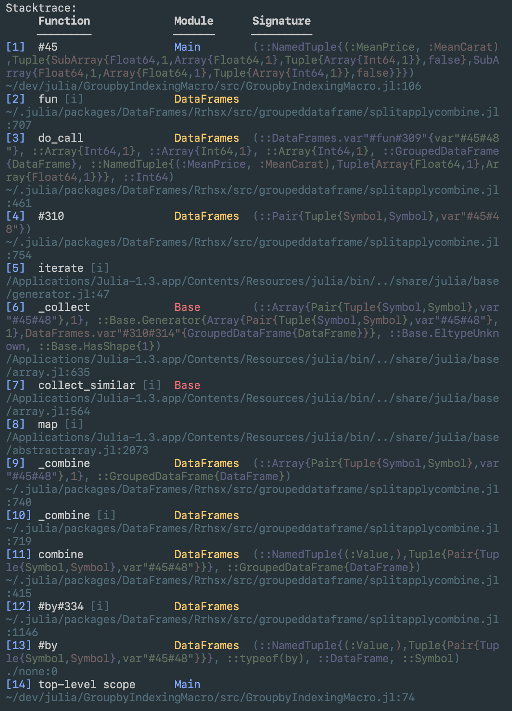

# ClearStacktrace

[](https://travis-ci.com/jkrumbiegel/ClearStacktrace.jl)
[](https://codecov.io/gh/jkrumbiegel/ClearStacktrace.jl)

An experimental package that hooks into `Base.show_backtrace` and replaces normal StackTrace printing behavior with a clearer version that uses alignment and colors to reduce visual clutter and indicate module boundaries, and expands base paths so they are clickable.

All you have to do is install the package via

```julia
] add ClearStacktrace
```

and then execute:
```julia
using ClearStacktrace
```

Example with `ClearStacktrace.jl`:


