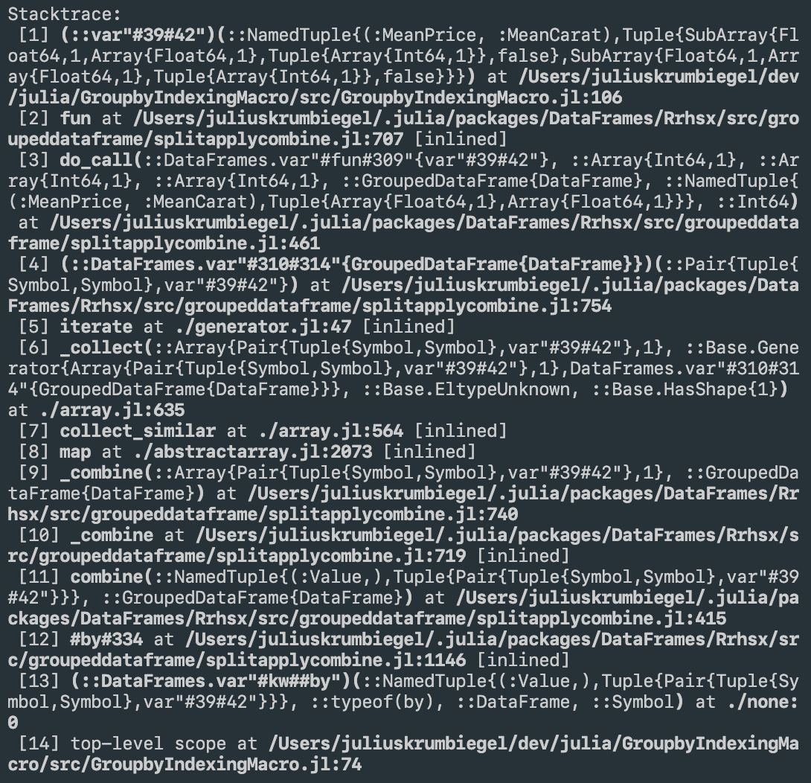

# ClearStacktrace

[](https://travis-ci.com/jkrumbiegel/ClearStacktrace.jl)
[](https://codecov.io/gh/jkrumbiegel/ClearStacktrace.jl)

An experimental package that hooks into `Base.show_backtrace` and replaces normal StackTrace printing behavior with a clearer version that indicates Modules, uses alignment and Crayon.jl colors to reduce visual clutter and expands base paths so they are clickable.

All you have to do is install the package and then execute:
```julia
using ClearStacktrace
```

Example with `ClearStacktrace.jl`:


And the default stacktrace:



Untested on Windows!
Also not registered, yet.

Much of the visual style and behavior can be configured via const Ref values. You can, e.g., choose different preset colors for the modules by changing `MODULECRAYONS` like this:
```julia
ClearStacktrace.MODULECRAYONS[] = [crayon"blue", crayon"green"]
```

These variables are defined here:
https://github.com/jkrumbiegel/ClearStacktrace.jl/blob/master/src/ClearStacktrace.jl#L5-L30
